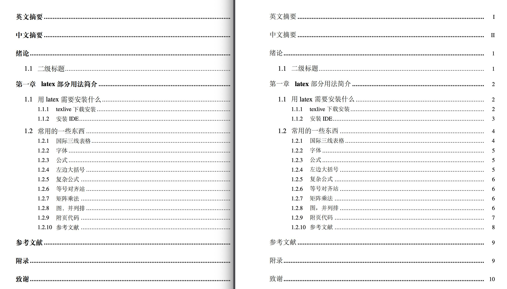

# 兰州大学本科生（学士学位）LaTeX模板

根据[这个项目](https://github.com/suchot/LZUThesis2017)进行修改的，出现什么问题，看下面的[常见问题](!##常见问题)。

> 另：template.pdf和template.tex两个文件可以用来学习latex，写了点东西

我强烈建议你用git管理毕业论文，每天写完以后就提交到gitee（速度比github快无数倍）上！！！不然不小心删除了什么的，哭都没地方哭去

## 待解决的问题
> 在家没带windows电脑，等回学校再解决
-  windows系统直接使用宋体加粗的命令，并没有加粗效果，导致目录一级标题、诚信责任页等地方并没有加粗效果，如下，左为mac下编译效果，右为windows，感谢同学帮忙测试


## 使用方法

只要把[paper.zip](paper.zip)下载然后解压就可以了，所有的都在那单独有一份，直接在那里面写论文


## 我怎么从老文件迁移过来？

1. 这个项目与[LZUThesis2017](https://github.com/suchot/LZUThesis2017)主要区别是：
   
    - lzubib.bst移动到了bib里面
    - 打包的里面LZUthesis.cls名字修改了
    - LZU.cfg被合并到LZUthesis.cls里面了
    - 适配了2020兰大毕业论文要求，修改了他遗留下了的诸多问题！！！！！
    - 文件名我看着不舒服，改成LZUThesis了，T大写

2. 学校的要求有哪些变化

    - 责任书有变化，模板中已经修改
    - 正文页眉单线，模板中已经修改
    - 封面有变化，模板中已经修改
    - 成绩页提到了前面
    - 英文摘要在中文摘要前面！并且摘要字体变成了2号（以前3号，我想不明白为啥要变成2号，太大了！标题都换行了，尤其是英文标题）
    - 增加绪论
    - 图表、目录等严格要求

3. 你需要做什么？
    - 先下载解压 paper.zip。

        模板已经适配2020，但是如果你已经写了文章，直接复制你的.tex到解压以后的文件夹里，需要你自己调整下面的：

    - 1、模板名字
        > 如果以前的.tex文件复制过来，必须要把前面一行名字改掉，以前是

        ```tex 
            \documentclass{LZUthesis}
            或
            \documentclass{LZUthesisonline}
        ```

        > 注意，我的这里面 *Thesis*第一个字母大写了，不大写我看着不舒服，敲代码的人应该明白

        ```tex 
            \documentclass{LZUThesis} 
        ```
        
    - 2、成绩页在责任书之后，以前在前面，需要你自己移动，位置如下
        ```tex

        \maketitle

        %======%
        %诚信说明页
        %授权说明书
        %======%
        \makestatement

        %=====%
        %论文（设计）成绩
        %=====%

        \supervisorcomment{导师评价你人很好}
        \recommendedgrade{80}

        \supervisorsignature{
            \raisebox{-10pt}{
                \includegraphics[width=60pt]{signature.pdf}
            }
        }

        \committeecomment{优秀}
        \finalgrade{100}
        \Grade

        % 注意成绩页在这个命令前面

        \frontmatter

        ```
    - 3、英文摘要请放在中文摘要前面！

    - 4、正文最前面有绪论（引言），模板中已经给了相关命令`\Intro`
        ```tex

        \tableofcontents
        %文章主体
        \mainmatter


        \Intro{
            这里是绪论，也可以说是引言，在LZUThesis2020.clc里面改
        }


        \chapter{latex部分用法简介}

        ```

4. 高级操作
   
    - 如果你曾经修改过参考文献格式lzubib.bst文件，请到bib文件夹中覆盖或修改
    
    - 如果你觉得封面上“本科生毕业论文(设计)”和“毕业论文（设计）成绩表”这几个字的字体与学校的范例不一样，你可以修改LZUThesis.cls文件，把它设置成雅黑字体。windows电脑上应该是有yahei这个命令，可以直接用；linux和mac需要你自己安装字体，然后自己新建一个这样的命令。
        ```tex
        \setCJKfamilyfont{yahei}{MicrosoftYaHei}
        \newcommand{\yahei}{\CJKfamily{yahei}}
        ```
        然后把现在设置在那几个字前面的`\heiti`改成`\yahei`
    >MicrosoftYaHei为你的字体在你电脑上上显示的名字，比如苹果电脑上：打开字体册应用，找到你自己安装的雅黑字体的PostScript名称


-------------

## 常见问题

1. **你可一定要先安装texlive，我用的2019版**
   
   > mac上我用的mactex，按照上面[mac系统 vscode用法](https://www.jianshu.com/p/c09b3409317f)这个教程就可以
    
2. 编译出来的没有参考文献或者目录：
    
    > 需要四步走xelatex - bibtex - xelatex - xelatex，具体什么意思，百度吧

3. 编译的和预期有差别，你把缓存的文件清理一下，重新四步走进行编译
    > 缓存的文件：比如你的文件名是paper.tex，那就删除以paper开头的所有文件，当然，paper.tex不要删除！！！！，理论上是这么做的，但是你删错了不关我的事。。。我用的sublime或者vscode点一下就删除了，好吧最多点两下

4. 其他的以后再补充，可以在issues里提交bugs，也可以直接联系我：肯定是兰大的，你登录i兰大易班，然后点 我的 - 关于我们 - 找到我们，直接内测群吧，不想在这放个人信息。
   > 百度错误的提示，基本上都能找到原因

## 项目主要文件

本项目精简了文件，只有LZUThesis.clc和bib、figure文件夹是必须的


1. bib文件夹里，database.bib是用来放你的参考文献的，

2. figure文件夹是一个图和导师签名

2. LZUThesis.clc这是模板配置文件，lzubib.bst是参考文献配置文件，小白请千万不要更改；

3. template.tex是用来写论文的，这个文件名字可以修改


--------

## 编译器选择

1. 不喜欢texStudio或者texmaker，用vscode吧，配置很简单，习惯sublime text3的也行

    [windows系统 vscode用法](https://zhuanlan.zhihu.com/p/38178015)

    [mac系统 vscode用法](https://www.jianshu.com/p/c09b3409317f)

    [linux系统 vscode用法](https://www.jianshu.com/p/c09b3409317f)

-------
## 5. 更新日志


### 2020.4.10

1. 说明：上个版本的介绍中绪论写错位置了，应在正文最前面
2. 去除雅黑字体，windows、linux、macos三合一，注意使用的时候最前面修改一下，别打我，这个以后绝对不改了
    ```tex 
    % 现在应该是
    \documentclass{LZUThesis} 
    % 之前是
    \documentclass{LZUThesis-mac} 
    ```
3. 优化封面和成绩评语界面，与word版更相似
4. 参考文献中可以由url、doi（mendeley生成的参考文献会携带），这样编译出来的pdf，点击参考文献可以直接跳转到原文界面
5. 新增 `textcomp`包，可以输入 `\textcelsius`，会变成摄氏度
6. 删除一些过时的内容，减少编译警告
7. 修改兰大logo为透明图，防止黑边
8. 以前那个库的历史遗留问题（错的地方太多了……）
   - 目录中一级标题加粗
   - 图表序号中间用点连接，序号与文字空一个字符
   - 中英文摘要字体大小、行间距等问题
   - 修复一些字号、字体设置不正确的问题

### 2020.4.7

mac版与windows分开打包，增加说明文件

### 2020.4.4 

适配了兰州大学2020最新的毕业论文（草拟稿）要求，最近还会修改

1. 页眉：单条线、页脚：页码居中
2. 封面、包括logo、和一些细节
3. 成绩表各种加黑问题，并且放在了前面
4. 添加了图片并排的一些库，里面提供了**常用的示例**
5. 针对mac电脑进行了测试和适配，修复了部分警告问题，合并一些文件，修复部分不符合论文要求的地方
