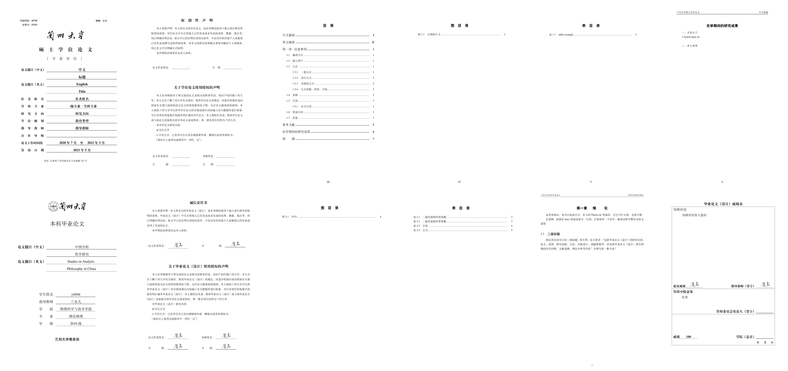

# 兰州大学毕业论文LaTeX模板

- 本科：2021正式开始使用新版毕业论文规范，[详情点我](http://jwc.lzu.edu.cn/lzupage/2021/02/25/N20210225145827.html)，此模板已经全面适配
- 研究生：2023新标准，[兰州大学博士硕士学位论文写作格式示例.PDF](https://ge.lzu.edu.cn/xiazaizhuanqu/xuewei/2023/0328/210732.html)

## 特点

- 已经适配最新要求
- 包含 “研究生” 和 “本科生” 两个模板
- 有问题 [github - issue](https://github.com/yuhldr/LZUThesis2020/issues?q=) 必回复
- 有贡献 [github - Pull requests](https://github.com/yuhldr/LZUThesis2020/pulls?q=)，必认真审查合并
- 注释、文档 很详细，小白上手可使用
- Linux、Mac、Windows 都能使用，有问题看文档

**********

## 使用方法

- 写完论文一定要再回来看看，在这期间模板是不是有所改变！
- [环境配置点我](md/START.md)
- 在 [这里](https://github.com/yuhldr/LZUThesis2020/releases/tag/自动打包) 下载相应的压缩包（yjs_：为研究生模板，bks_：为本科生模板），解压以后 [template.tex](template.tex) 里写
- 遇到问题先看  [常见问题](md/QA.md)

--------

## 项目主要文件

本项目精简了文件，只有 `LZUThesis.cls` 和 `bib`、`figure` 文件夹是必须的

- [bib](bib) 文件夹里，[database.bib](bib/database.bib) 是用来放你的参考文献的，可以修改；[lzubib.bst](bib/lzubib.bst)是参考文献配置文件，小白请千万不要更改；

- [figure](figure) 文件夹是一个图和导师签名

- [LZUThesis.cls](LZUThesis.cls) 这是本科生模板配置文件，最初根据 [这个](https://github.com/suchot/LZUThesis2017) 修改的

- [template.tex](template.tex) 是本科生用来写论文的，这个文件名字可以修改

- [LZUThesis-PgD&PhD.cls](LZUThesis-PgD&PhD.cls) 这是研究生模板配置文件，来自 [这里](https://github.com/JChrysanthemum/LZUThesis2020-PgD-PhD.git)，他根据我这个修改的，改了很多很多，但是好像不维护了，有问题在我这里提问我来修改

- [template-PgD&PhD.tex](template-PgD&PhD.tex) 是研究生用来写论文的，这个文件名字可以修改

--------

## 其他

简单做了两个答辩 `latex` 的 PPT模板：[这里](md/OTHER.md)

--------

## 更新说明

[看这里](md/CHANGELOG.md)

--------

建议你用 `git` 管理毕业论文，每天写完以后就提交到gitee（速度比github快无数倍）上！！！不然不小心删除了或者中病毒了什么的，就。。。

更多LaTex模板资源可以去：[latexstudio](https://www.latexstudio.net)，资源和一些教程确实不错