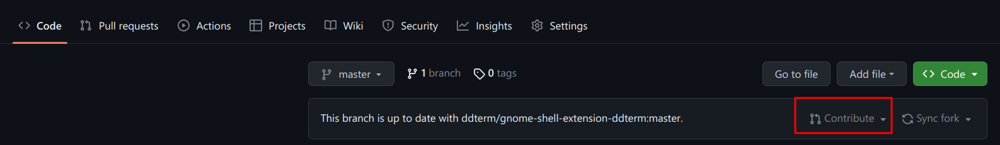
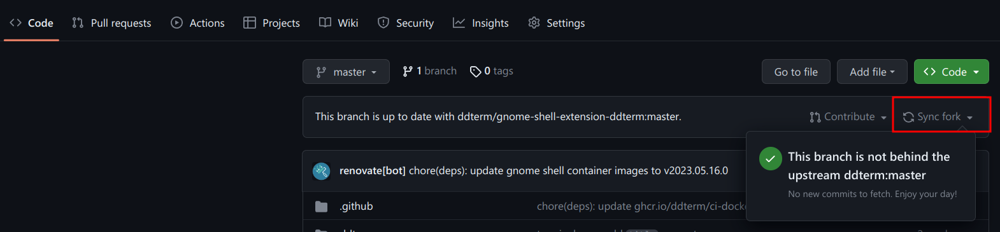
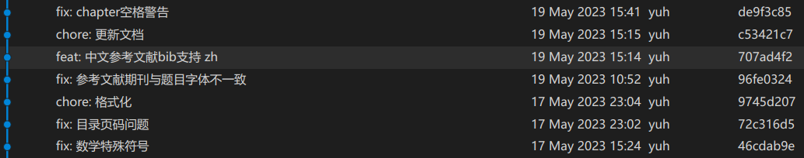

# 贡献说明

> `git` 怎么用，或者 `git` 怎么 `ssh` 自己的github项目，请百度

1. 直接在 `github` 项目右上角点 `fork`，项目会到自己名下

    

2. 本地设置好 `git`，然后将自己名下的这个项目 `git pull ssh` 到本地(如果不是第一次提交，一定要先按照下面最后一步的`Sync fork`)，在本地修改
3. 更改以后，本地 `git commit`（请严格遵守 [commit更改说明的格式](#commit更改说明的格式) ） 
4. 然后 `push` 到你的名下项目
5. 打开 github，点如下图 `contribute`，并填写 `PR` 说明

    

6. 请关注此项目您提交的 `PR` 讨论（github绑定的邮箱会提醒），如果有需要修改的内容，您在本地修改以后，重新 `commit、push、contribute`，注意，如果期间此项目有更改，请点如下图 `Sync fork`，并重新 `ssh` 到本地，以防止冲突

    


## commit更改说明的格式

> 暂定，效果类似如图，方便别人查找更新类型、内容



提交命令类似如下

> 注意！！`fix/feat/chore` 后面的 `冒号是英文的`，并且冒号后面有个 `空格`

```bash
git commit -m "fix/feat/chore: 这是简要的修改说明"
```

其中

- `fix`：修复bug
- `feat`：新增内容
- `chore`：日常维护：比如更新文档、latex使用说明
