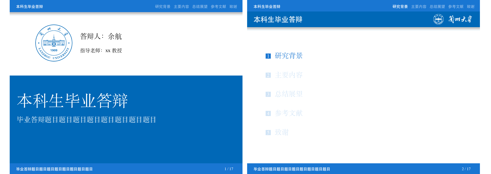

2022.5.6 转博士答辩，又做了个模板：SimpleBeamerLZU，感觉更好一些，清爽！

- [Gitee](https://gitee.com/yuhldr/SimpleBeamerLZU) 和 [Github](https://github.com/yuhlzu/SimpleBeamerLZU)
- 预览第1页|预览第4页
    :-:|:-:
    |

2020.5.30做了个毕业答辩模板 LZUBeamer：[Gitee](https://gitee.com/yuhldr/LZUBeamer) 和 [Github](https://github.com/yuhlzu/LZUBeamer)，可以去看看：

  - 
