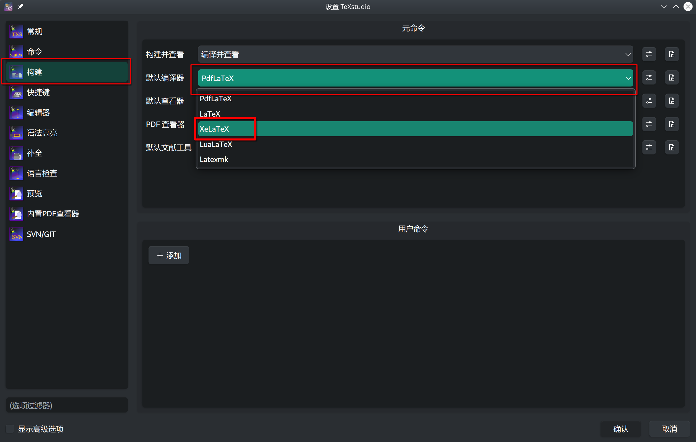
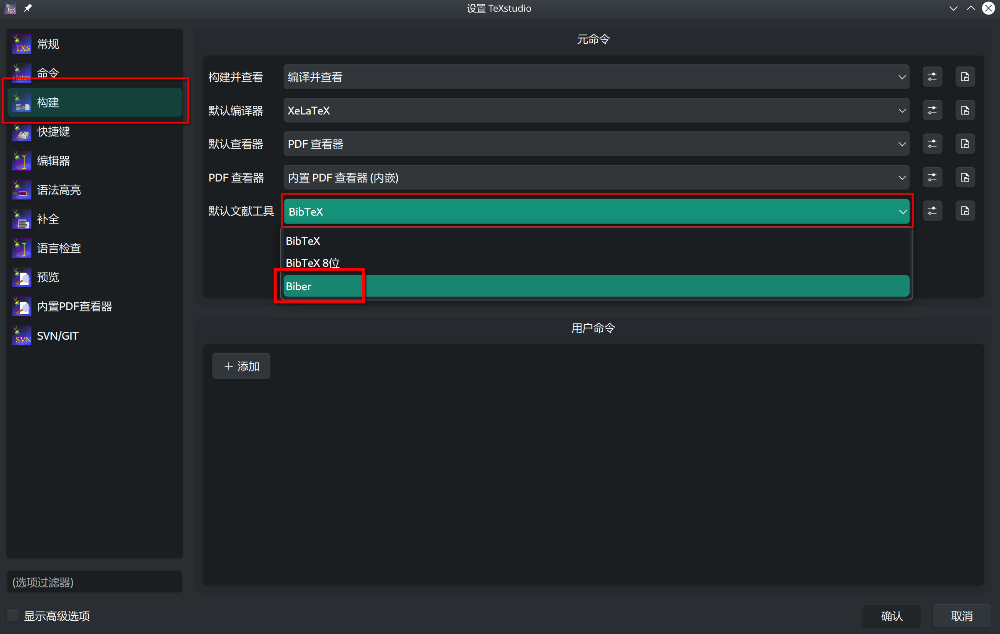

# 常见问题

> 注意！！！`LaTex模板` 只能是与 `学校论文要求` 尽可能相同，但是不完全模仿学校给的 `word示例文件`，尤其是一些特殊字体，不会去适配，那个 `word` 只是个示例。

一定要先安装 `texlive`（无论你用的是 `texstudio` 还是 `vscode` 或者其他），可参考 [START.md](START.md)

mac、linux、windows三系统全部测试通过，linux缺一个字体，看 [linux环境字体](#可能是Linux环境字体导致)，其他出现什么问题，也看下面的，下面解决不了的，去 `github-issue` 提出


## 编译出问题

> 编译出来的没有 `参考文献` 或 `目录`，或者直接失败：

- 请卸载 `CTEX`、`MIKTex`，使用 `texlive`

- 用 `texstudio(推荐)` 或 `vscode`（[点我：编译器选择](./START.md/#编译器选择)）。不要用 `texwork`、`texmaker`，

- 不要用 `pdflatex` 那个！需要四步走，`xelatex`、`biber`、`xelatex`、`xelatex`，看不懂这句话的话，具体百度一下

比如 `texstudio` 设置中 `pdflatex` 修改为 `xelatex`，以及 `bibtex` 改为 `biber`

改为 xelatex | 改为 biber
-|-
 | 


### biber编译失败

我在部分 `windows10` 上遇到过一个奇怪的问题。类似[这个](https://github.com/plk/biber/issues/59)，自己网上百度解决吧。我不用` windows10`，懒得管了

你是在解决不了就用 [overleaf](https://www.overleaf.com/project) 在线编译吧


### 可能是Linux环境字体导致

> 因为linux上默认没有Arial字体

- 方法一：可以自己网上找一下，下载安装，注意名字（不是文件名，而是安装以后的字体名）要完全对上
- 方法二：可以搜索在 `LZUThesis.cls` 文件中搜索 `\fontspec{Arial}`，将这一个命令删除，这个字母不用这个字体了（有点不符合论文对英摘要的要求）。

### 可能是缓存问题

> 编译的和预期有差别，你把缓存的文件清理一下，重新四步走进行编译，或者直接保存、重启电脑

- 缓存的文件：比如你的文件名是 `template.tex`，那就删除以 `template` 开头的所有文件，当然，`template.tex` 不要删除！！！！

- 理论上是这么做的，但是你删错了不关我的事。。。

- 我用的vscode点一下就删除了，好吧最多点两下，删错了，如果之前用了git的话，可以恢复


## 字体

### 与word细微差别

- [见讨论](https://gitee.com/yuhldr/LZUThesis2020/issues/I6QJCA)

### 字母加粗

- [见讨论](https://github.com/yuhldr/LZUThesis2020/issues/15)


### 英文字体略有不同（花体太花）

V2.1.3以及以后的版本，为了让英文字体完全与Times New Roman字体相同，使用了mathptmx和fontspec包，但是这么做会导致花体，mathcal和mathscr完全相同（正常mathcal会花的轻一些）。

在windows上，引用mathptmx包，正文、公式中的英文就会变成新罗马（Times New Roman）字体，但是mac系统上，没有任何效果，还是默认的罗马字体（和Times New Roman很相似，QR两个单词区分明显，之前的字体整体偏细），所以我在2.1.3以及之后的模板中加入了以下两个命令：

```tex
\RequirePackage{mathptmx} %加入这条命令会导致花体，mathcal和mathscr完全相同，正常mathcal会花的轻一些。
\RequirePackage{fontspec} %这一条在windows可有可无，效果相同，但是mac上必须。
```


## 参考文献


遇到问题去这里找答案[biblatex-gb7714-2015](https://github.com/hushidong/biblatex-gb7714-2015?tab=readme-ov-file#tutorial%E4%BD%BF%E7%94%A8%E5%85%A5%E9%97%A8)

因为是直接引用的，具体的设置在 `.cls` 文件中的 `backend=biber` 这一行，


以前的以下问题已经消失

- 研究生论文参考文献丑：通过默认设置 `gbnamefmt=lowercase` 英文作者首字母大写（而不是所有字母大写）
- 参考文献标题中英文变成小写
- 参考文献多位中文作者


## 其他

## 签名没有对齐

- [见 Issue](https://gitee.com/yuhldr/LZUThesis2020/issues/I77IDC#note_18273533)

## chapter间距问题

- [讨论1](https://github.com/yuhldr/LZUThesis2020/issues/7)
- [讨论2](https://gitee.com/yuhldr/LZUThesis2020/issues/I6QZKG
)

### “摘要”前面的标题也想手动换行

有时候化学式大小写也有问题

这个。。。你可以自己来，改模板对应的位置就行，不要自动英文大写了，自己敲

打开你用的模板[LZUThesis.cls](/LZUThesis.cls)（或你在用[LZUThesis-PgD&PhD.cls](/LZUThesis-PgD&PhD.cls)）

```tex

% 中文摘要，找到下面一行
\zihao{3}\bfseries\heiti \noindent\@title\the\titlextra
% 修改\@title\the\titlextra  这一部分替换成你自己想要的标题

%英文摘要，找到下面一行
\zihao{3} \bfseries \noindent \expandafter\MakeUppercase\expandafter{\the\entitle\the\entitletra}

% \expandafter\MakeUppercase\expandafter{\the\entitle\the\entitletra}  这一部分替换成你自己想要的标题
```


### 封面文字位置

> 如：封面“兰州大学教务处”几个字跑到了第二页，或者不在最下面（偏上）

你的题目太长了，你可以改一下模板

模板中搜索“兰州大学教务处”，在它上面有一行类似如下：可以调整40（或者100）这个数字

```tex
\vspace{40pt}
%或者
\vspace{100pt}
```


### 章节问题

> 正文第一章，编号却是第二章？

请把绪论作为第一章，大多数老师不认第0章！！！

```tex
%生成目录
\tableofcontents
%文章主体
\mainmatter

\Intro{
    这里是绪论

    \section{二级标题}
    绪论其实也可以有二级标题
}

% =======正文从第一章开始，需要把章节的编号归0
\setcounter{chapter}{0}

\chapter{latex部分用法简介}
```

## 用法疑问

> 表格居中、换页、换行、图片并列排等，怎么用

你仔细看 [template.pdf](../template.pdf) 和 [template.tex](../template.tex) 吧，里面都有

### 其他的

- 在 `tex文件` 所在路径，终端输入 `xelatex 你的tex文件名`（比如 `xelatex template-PgD\&PhD.tex` 或者 `xelatex template.tex`），根据错误提示，百度，基本上都能找到原因

- 以后再补充，如果是bugs，可以在issues里提交bugs，方便别人参考，请 **勿** 直接QQ联系我！

- 我已经多次多人测试通过，如果你什么都没改，就直接编译失败的肯定是你自己的原因！！

- 目录有页码，但是要求中不需要

  其实，不要什么事情都来找模板的问题，你可以自己改的，目录去掉页码可以在tex文件里改

  ```tex
  %生成目录
  \tableofcontents
  % 去掉页码
  \thispagestyle{empty}
  ```
