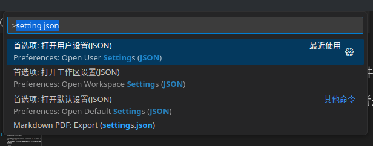
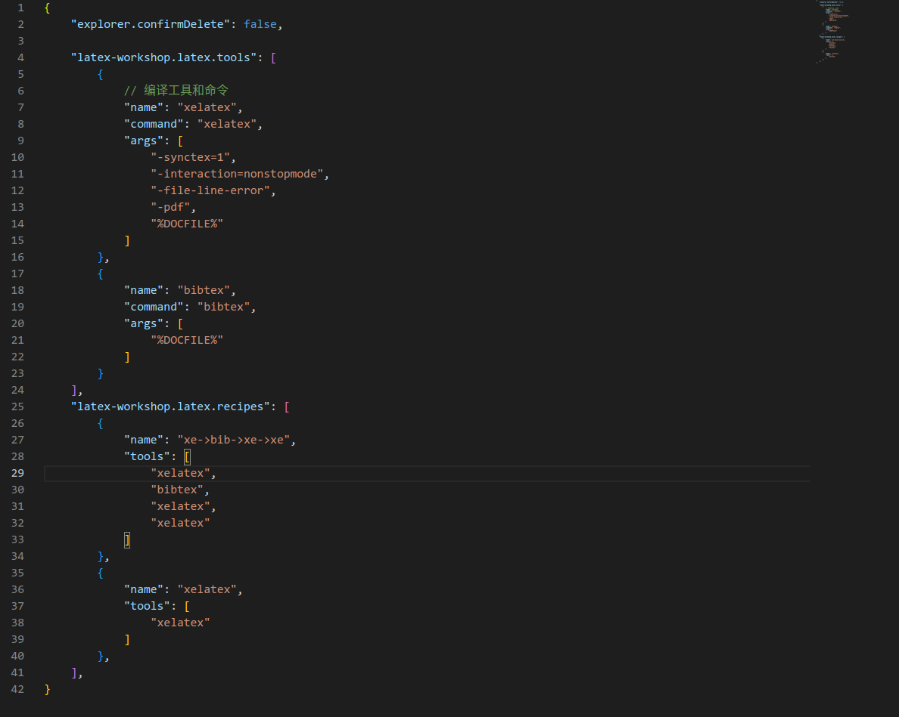
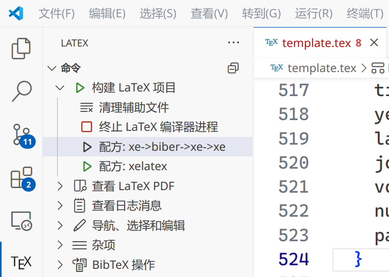
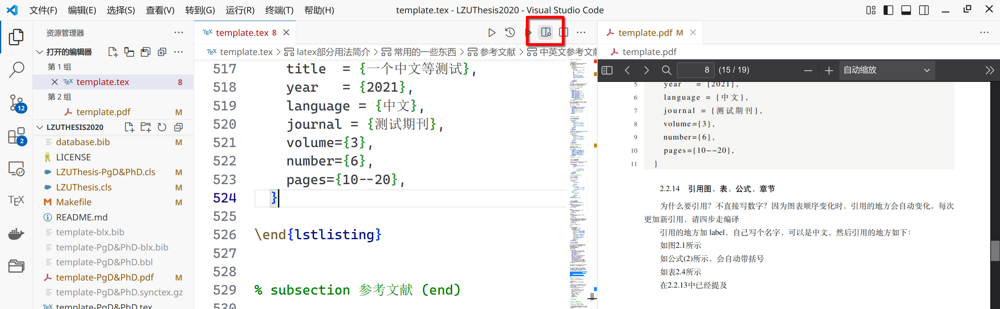

# 从 0 配置

> 注意！！最后一次编译前，请返回 [项目这里](https://github.com/yuhldr/LZUThesis2020/releases)，**更新** 到最新的模板，一般只需要更新 `*.cls` 文件即可、部分时候需要更新 `lzubib.bst`，详细变化请查看 [更新说明](CHANGELOG.md)

所以平时不要轻易修改这两个文件，有问题来 [issue](https://github.com/yuhldr/LZUThesis2020/issues/new/choose) 反馈、或提交 [PR](https://github.com/yuhldr/LZUThesis2020/pulls)

## 方法一

> 如果你就这一次用 LaTex，以后都不需要了，可以试一下，但是如果你还上研究生要发文章，还是按照 [方法二](#方法二) 本地安装一下吧

1. 打开 [overleaf](https://cn.overleaf.com/) 网站
2. [点我](https://github.com/yuhldr/LZUThesis2020/releases/tag/%E8%87%AA%E5%8A%A8%E6%89%93%E5%8C%85) 下载压缩包、然后在 [overleaf](https://cn.overleaf.com/) 这个网站上传

   依次点击：`创建新项目 - 上传项目`（直接上传刚才下载的压缩包即可）

3. 修改编译方式

   左上角 `菜单` 里把 `设置-编译器` 里的 `pdfLatex` 改成 `xelatex`！！

## 方法二

> 数据在本地，自由度更高、安全性更高

用 `LaTex` 需要安装什么，需要安装 `texlive`，外加一个 `IDE`（比如 `texstudio` 或 `vscode`）

1. 安装 `texlive`

2. 测试安装是否成功

3. 配置编译器，可见[编译器选择](#编译器选择)，不要使用 `TexLive` 自带的 `texwork`！！请使用`texstudio` 或 `vscode`！！

---

### texlive 安装

已经出2025了，可以用兰大的镜像下载应该在用校园网时快一些，额，你还是用清华的镜像吧，我刚才找了一下，兰大镜像这会儿竟然挂了。。。

下载地址： 点下面的字跳转浏览器下载了，方便吧

- [TexLive 最新版 Windows 版](https://mirrors.tuna.tsinghua.edu.cn/CTAN/systems/texlive/Images/texlive.iso)
- [TexLive 最新版 Mac 版（mactex）](http://tug.org/cgi-bin/mactex-download/MacTeX.pkg)

具体怎么安装百度吧，很多图文教程

安装提示

- 不要解压，`iso`文件直接挂载
- 有些电脑安装极慢，甚至一个多小时。。。

### 测试是否安装成功

`终端` （windows10 指的是 `powershell`）输入 `latex`，如果可以看到

```bash
This is pdfTeX, Version 3.141592653-2.6-1.40.24 (TeX Live 2022) (preloaded format=latex)
 restricted \write18 enabled.
**
```

说明成功

### 编译器选择

推荐用 [texstudio](https://texstudio.sourceforge.net/) 吧，最简单，设置需要修改两个地方

改为 xelatex | 改为 biber
-|-
 | 

---

也可以用 vscode，以下为配置

1. 安装 vscode：
   去官网安装：[Vscode](https://code.visualstudio.com/)

2. 安装插件：

   在 vscode 左边侧栏插件处输入 latex，安装以下插件

   `LaTex Workshop` 最近好像有个假的，选那个作者是 `James Yu` 的

3. 配置 vscode：

   打开 json 配置，快捷键 `ctrl shift P`，输入 `user setting json`，如图选择第一个
   

   将下面的内容复制到设置区：

   ```json
    "latex-workshop.latex.tools": [
        {
            // 编译工具和命令
            "name": "xelatex",
            "command": "xelatex",
            "args": [
                "-synctex=1",
                "-interaction=nonstopmode",
                "-file-line-error",
                "-pdf",
                "%DOCFILE%"
            ]
        },
        {
            "name": "biber",
            "command": "biber",
            "args": [
                "%DOCFILE%"
            ]
        }
    ],
    "latex-workshop.latex.recipes": [
        {
            "name": "xe->biber->xe->xe",
            "tools": [
                "xelatex",
                "biber",
                "xelatex",
                "xelatex"
            ]
        },
        {
            "name": "xelatex",
            "tools": [
                "xelatex"
            ]
        },
    ],
    "latex-workshop.latex.clean.fileTypes": [
        "*.xdv",
        "*.aux",
        "*.thm",
        "*.bbl",
        "*.blg",
        "*.idx",
        "*.ind",
        "*.lof",
        "*.lot",
        "*.out",
        "*.toc",
        "*.acn",
        "*.acr",
        "*.alg",
        "*.glg",
        "*.glo",
        "*.gls",
        "*.ist",
        "*.fls",
        "*.log",
        "*.fdb_latexmk",
        "*.run.xml",
        "*.snm",
        "*.nav",
        "*-blx.bib",
        "*.synctex.gz",
        "*.bcf",
        "*.xml",
        "*.synctex",
        "*.nlo",
        "*.nls",
        "*.bak",
        "*.ilg",
        "*.ent-x",
        "*.tmp",
        "*.ltx",
        "*.los",
        "*.lol",
        "*.loc",
        "*.listing",
        "*.gz",
        "*.synctex(busy)",
        "*.vrb"
    ],
   ```

   > 如果有红色曲线，说明你配置得有问题，一般是逗号、大括号什么的有问题

   注意：你要粘贴的地方，下面有一个右大括号 `}` ，前面有一个英文逗号`,` 或者 `{`;

   整个文件类似如下：

   

4. 配置成功以后的界面：

   - 注意配置以后要打开 `vscode`，再点开一个 `.tex` 文件，左侧才会出现 `Tex` 选项，类似如图（我的配置比较多，你们的应该就两个）

     

   - 点 `xe->bib->xe->xe` 就可以编译，平时只是修改文档，没有引入参考文献和图表公式的引用，只需要 ctrl 和 s（mac：command 和 s）快捷键就可以编译。

   - 打开 tex 文件，点右上角这个类似 “窗户搜索” 的按钮，可以一边 `tex` 一边 `pdf`
     

   - 鼠标光标在 `.tex` 文件里，快捷键`ctrl-J`，右边 pdf 会指出当前位置
   - 鼠标左键双击 `pdf` 会显示对应左边 `.tex` 哪里

## 一些使用技巧

## 高级操作

一般人，不要按照下面的操作！！！你会把模板改坏的，最后改到编译错误让你自己崩溃（改到你仰望我的 LaTex 水平 😂，好吧，其实我也是一天学会的，不过本科阶段你们好好学习时我就折腾过……）。。。

1. 如果你觉得封面上“本科生毕业论文（设计）”和“毕业论文（设计）成绩表”这几个字的字体与学校的范例不一样（我现在用的是黑体）你可以修改 LZUThesis.cls 文件，把它设置成雅黑字体。windows 电脑上应该是有 yahei 这个命令，可以直接用；linux 和 mac 需要你自己安装字体，然后自己新建一个这样的命令。

   ```tex
   %windows系统不需要这个操作，只有linux与mac需要先百度去安装字体，再自定义如下命令

   \setCJKfamilyfont{yahei}{MicrosoftYaHei}
   \newcommand{\yahei}{\CJKfamily{yahei}}
   ```

   然后把现在设置在那几个字前面的`\heiti`改成`\yahei`

   > `MicrosoftYaHei` 为你的字体在你电脑上上显示的名字，比如苹果电脑上：打开字体册应用，找到你自己安装的雅黑字体的 PostScript 名称

2. ~~成绩页等加粗字体有问题，并不是宋体加粗而是黑体！~~

   > 2020.5.29(2.0.0)版已经解决该问题，开启伪加粗即可，详见：[现状 0：以前用的这个模板，现在需要升级](#%e7%8e%b0%e7%8a%b60%e4%bb%a5%e5%89%8d%e7%94%a8%e7%9a%84%e8%bf%99%e4%b8%aa%e6%a8%a1%e6%9d%bf%e7%8e%b0%e5%9c%a8%e9%9c%80%e8%a6%81%e5%8d%87%e7%ba%a7)

   ~~中文在 xelatex 中，windows 并不支持加粗命令`\textbf{}`或者`\bfseries`，为了方便和适配更多的系统，[大家一般都换成了黑体](https://www.zhihu.com/question/58456658)，我测试过打开全局伪加粗，windows 并没有效果（mac 和 linux 不打开就有效果），你要是很严谨（强迫症），可以自己安装加粗字体，自定义命令实现加粗（mac 和 linux 用户，可以直接使用加粗的命令，会自动伪加粗，效果也不错，我就是这么用的），需要改的地方如下~~

   ~~在最新版的 LZUThesis.cls 文件中搜索：`应该是加粗`，可以找到应该改的地方，把这里的黑体设置，改成旁边注释括号里的要求~~

   ~~示例如下：~~

   ```tex
   原本是

   \begin{center}
       {\heiti\zihao{3}{诚信责任书}} % “诚信责任书”这几个字，应该是加粗（宋体加粗）
   \end{center}

   mac或linux可以改成伪加粗

   \begin{center}
       {\songti\bfseries\zihao{3}{诚信责任书}} % “诚信责任书”这几个字，应该是加粗（宋体加粗）
   \end{center}

   windows需要改成：

   %先百度安装字体，再在最前面合适的地方自定义加粗字体，比如你安装的字体名是：宋粗体
   \setCJKfamilyfont{csong}{宋粗体}
   \newcommand{\csong}{\CJKfamily{csong}}

   %然后修改需要修改的地方
   \begin{center}
       {\csong\zihao{3}{诚信责任书}} % “诚信责任书”这几个字，应该是加粗（宋体加粗）
   \end{center}
   ```

以上问题我在模板中没有修改的原因：

> 一个模板，对于大多数人来说，拿来就可以用（兼容性好、体验也可以）才是最重要的
> ，而一些细节问题，是为那些有能力（或者说爱折腾，不是贬义词）的人留下的，所以我对于遗留的问题在 cls 文件里，都做了注释说明

1. 如果你曾经修改过参考文献格式 lzubib.bst 文件，请到 bib 文件夹中覆盖或修改，但是我觉得我的可能更完美 ~
